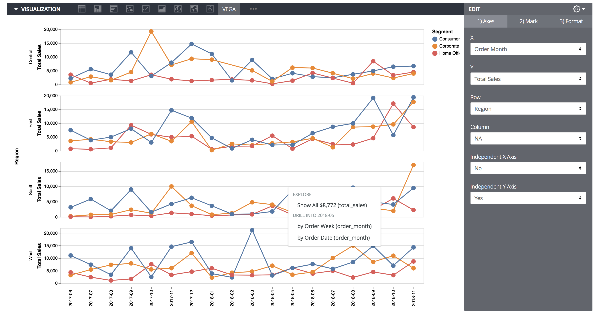
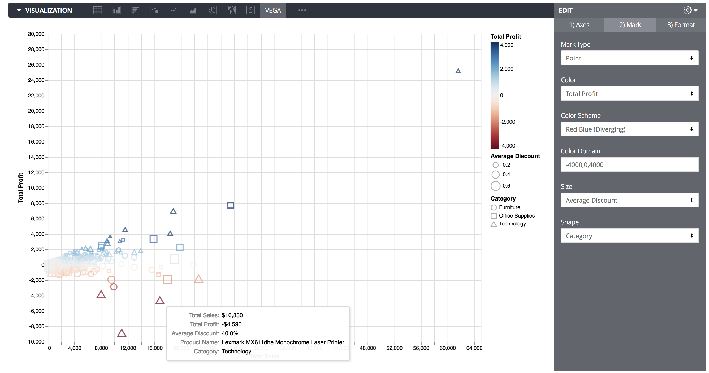
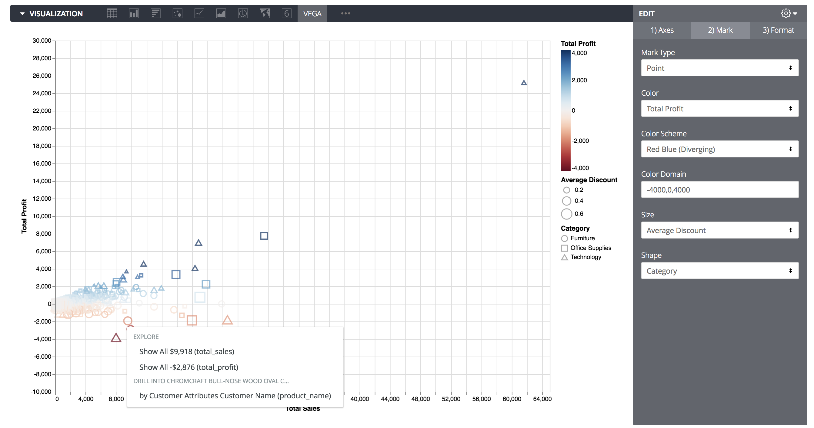

# Vega-Lite for Looker
Vega is an incredible way to create visualizations, stated in their own words:
# Vega is a visualization grammar, a declarative language for creating, saving, and sharing interactive visualization designs. With Vega, you can describe the visual appearance and interactive behavior of a visualization in a JSON format, and generate web-based views using Canvas or SVG.

This Looker version adds a number of ui elements to craft visualizations in Vega-Lite, a higher-level language built on top of Vega:
https://vega.github.io/vega-lite/

The main js file is available hosted here:
https://s3.us-east-2.amazonaws.com/grood-lookin/vega.js

Dependencies that need to be added to your Looker Custom Viz are hosted here:
https://cdn.jsdelivr.net/npm/vega@4.3.0/build/vega.js
https://cdn.jsdelivr.net/npm/vega-lite@3.0.0-rc8/build/vega-lite.js
https://cdn.jsdelivr.net/npm/vega-embed@3.20.0/build/vega-embed.js

All charts you create will maintain their drill paths with additional info about which field is generating the drill link.

A few examples of what you can create with Vega-Lite for Looker:

Basic trellising:

Multi-facet trellising:

Bubble Plots:

Heatmap:

Scatter Plots:

