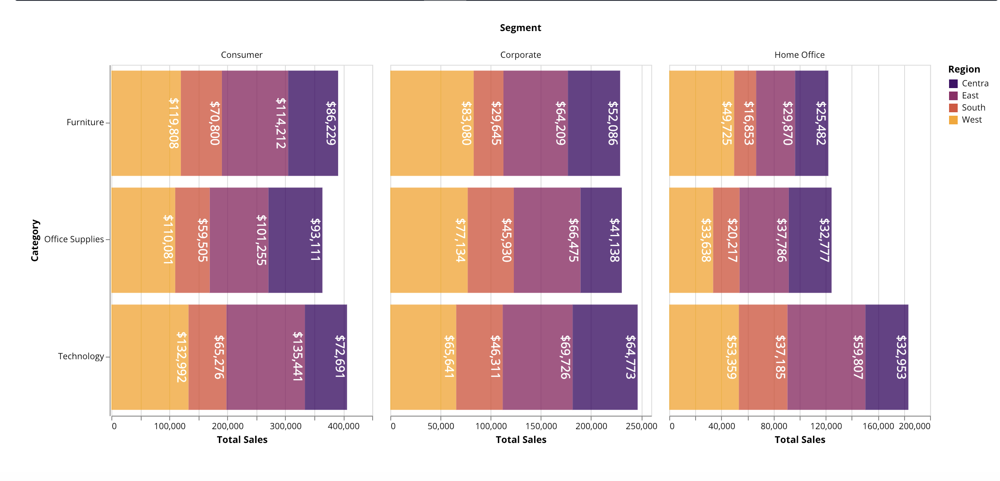
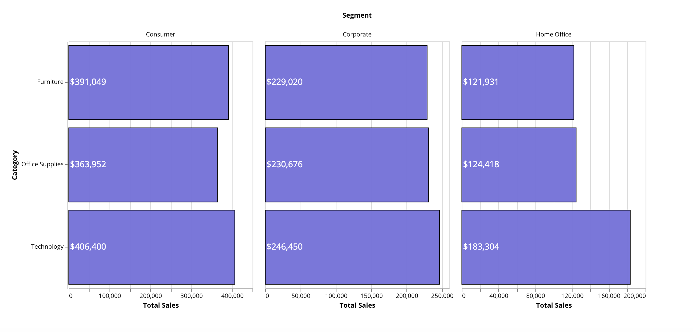
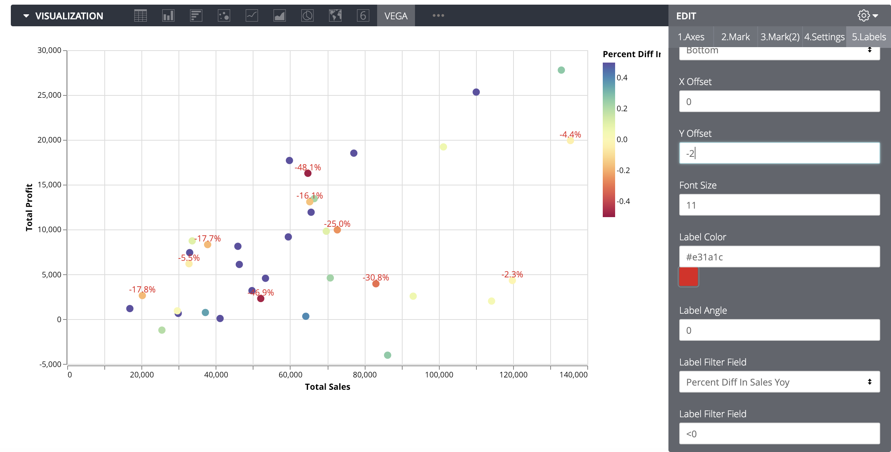
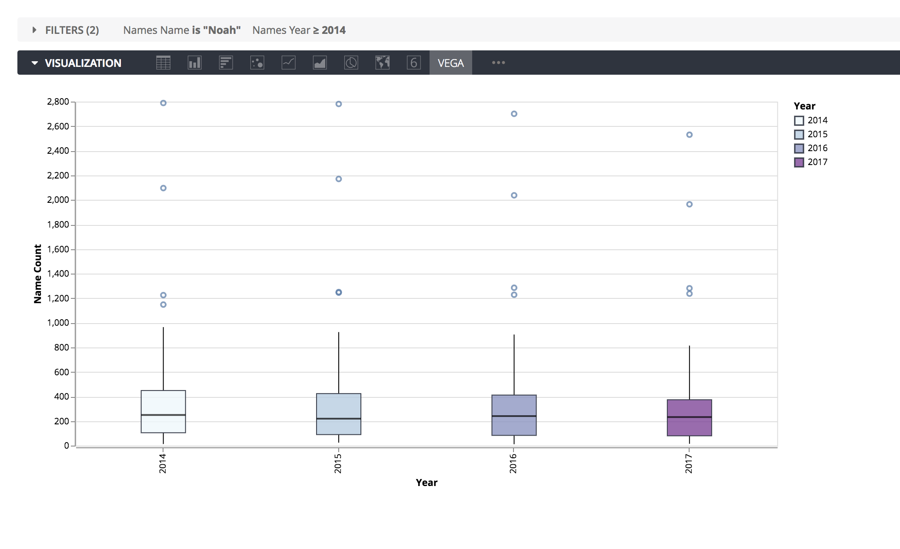
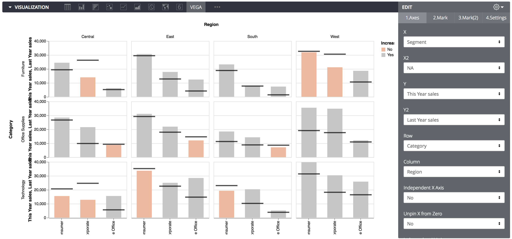
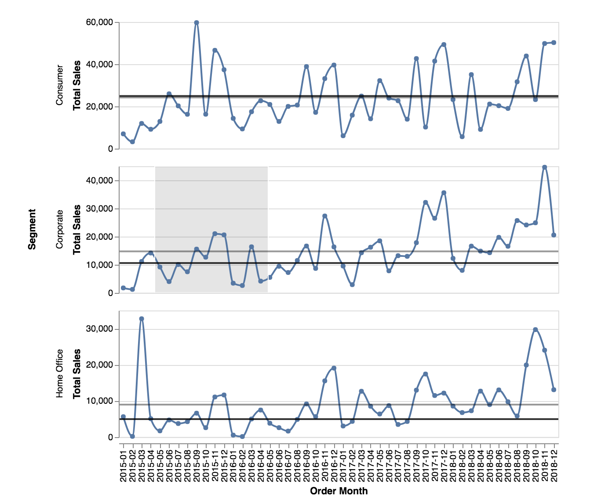
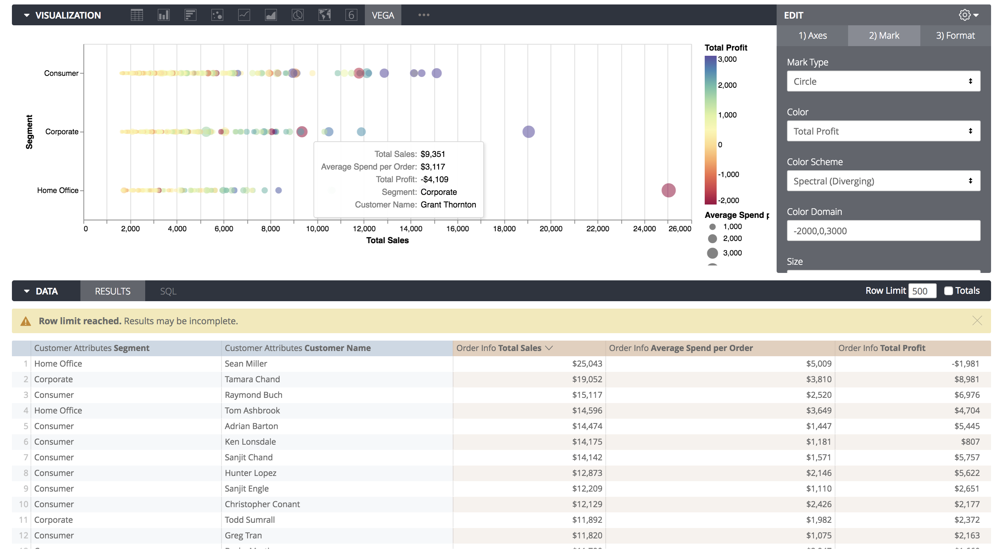
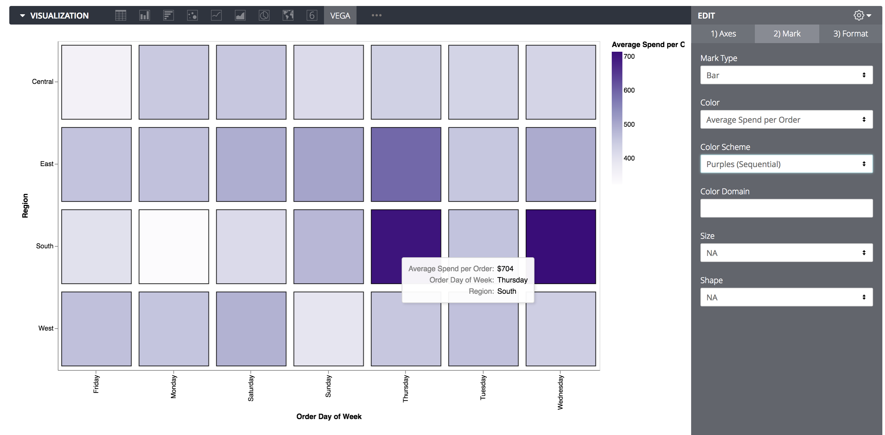
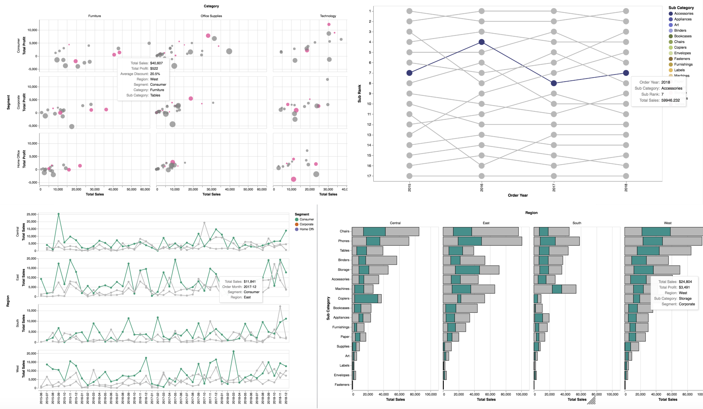

# Vega-Lite for Looker
Vega is an incredible way to create visualizations, stated in their own words:
# Vega is a visualization grammar, a declarative language for creating, saving, and sharing interactive visualization designs. With Vega, you can describe the visual appearance and interactive behavior of a visualization in a JSON format, and generate web-based views using Canvas or SVG.

More complex Vega visuals in Looker: https://github.com/groodlooker/vega

**New as of 12/22/18 Added Support for mark type 'boxplot'**

**New as of 1/14/18 Support for Labels vega-3.js**

This Looker version adds a number of ui elements to craft visualizations in Vega-Lite, a higher-level language built on top of Vega:

https://vega.github.io/vega-lite/

Versions:

Beta with sort & label fixes:
https://s3.us-east-2.amazonaws.com/grood-lookin/vega-3-1.js

Vega-lite for Looker 1.0
https://s3.us-east-2.amazonaws.com/grood-lookin/vega.js

Vega-lite for Looker 2.0:
https://s3.us-east-2.amazonaws.com/grood-lookin/vega-2.js

Vega-lite for Looker 3.0
https://s3.us-east-2.amazonaws.com/grood-lookin/vega-3.js

Dependencies that need to be added to your Looker Custom Viz are hosted here.
**Please refer to this link https://vega.github.io/vega-lite/usage/embed.html 
for most up-to-date dependencies**
(Newer versions of Vega-lite for Looker may not work without updating to the newest Vega dependencies)

https://cdn.jsdelivr.net/npm/vega@5.0.0-rc2

https://cdn.jsdelivr.net/npm/vega-lite@3.0.0-rc13

https://cdn.jsdelivr.net/npm/vega-embed@3.29.1

All charts you create will maintain their drill paths with additional info about which field is generating the drill link.

A few examples of what you can create with Vega-Lite for Looker:

**Labels available in 3.0**

Label can be pinned to the field value or to zero:

Apply filters/conditions to labels:

**New as of 12/22/18 box plot support**

**Multi-layer support availabe in 2.0**

Value vs Target charting:

Lollipop style charts:

Reference Lines that update on selection:

**Functionality in original vega-lite**

Bar trellising:

Multi-facet trellising:

Bubble Plots:

Heatmap:

Scatter Plots:

Highlighting:

Vega-Lite enables even richer visualization than this current version of "Vega-Lite for Looker" will allow for. Future iterations of this will include layers or "dual axis" support, cross-highlighting capabilities, more formatting options (line thickness, fonts, etc) and possibly crossfiltering.
